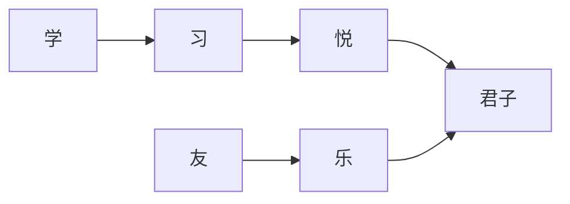

# 《论语·学而》读书笔记

> 学而时习之，不亦说乎？有朋自远方来，不亦乐乎？

## 三句要点

- **学**：学了要按时温习
- **友**：朋友从远方来
- **君子**：人不知而不愠

## 每日三省

| 省什么 | 原文 |
| --- | --- |
| 做事 | 为人谋而不忠乎 |
| 交友 | 与朋友交而不信乎 |
| 学习 | 传不习乎 |

```mermaid
flowchart LR
学 --> 习 --> 悦
友 --> 乐
悦 --> 君子
乐 --> 君子
```
